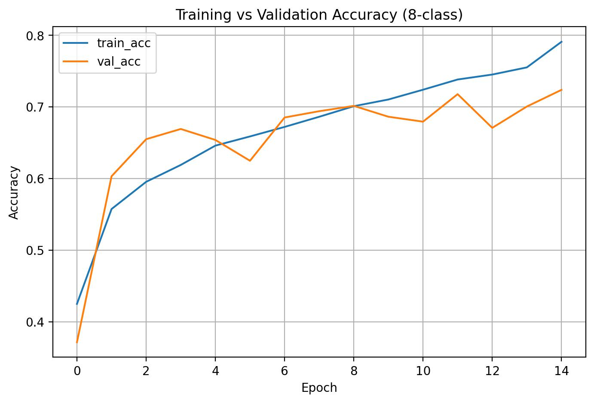
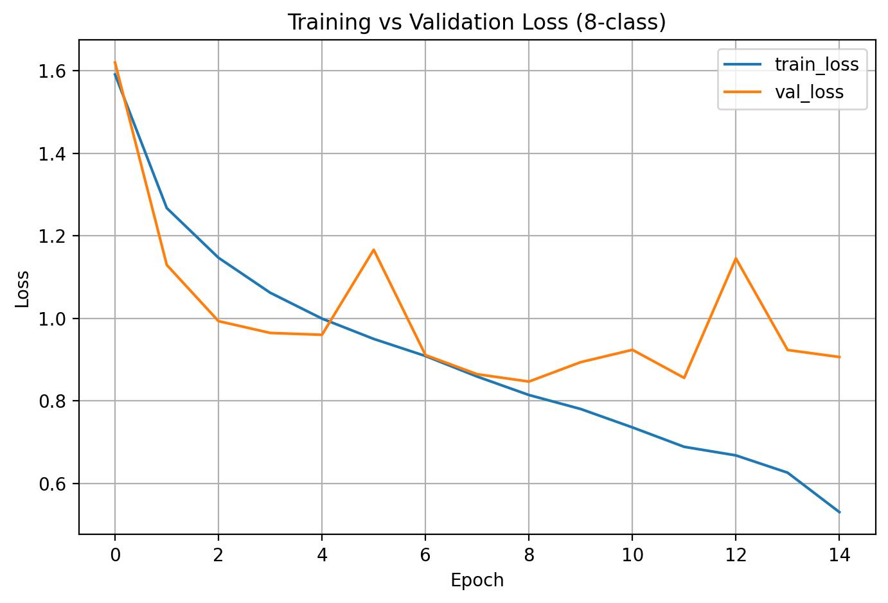
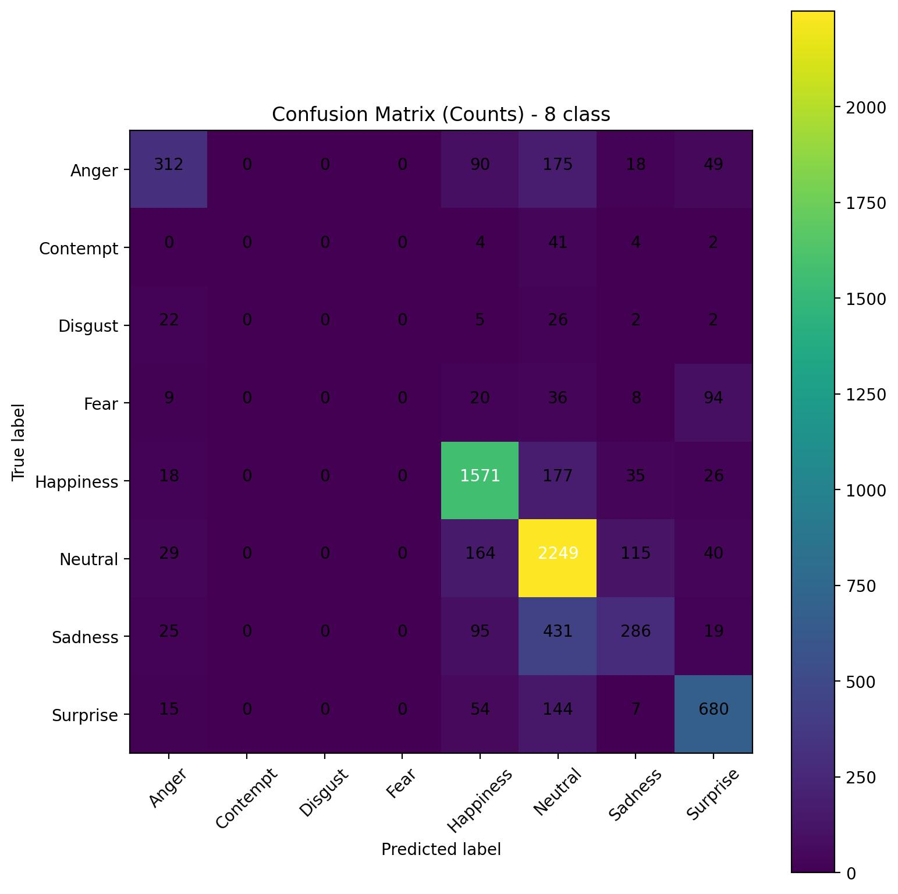
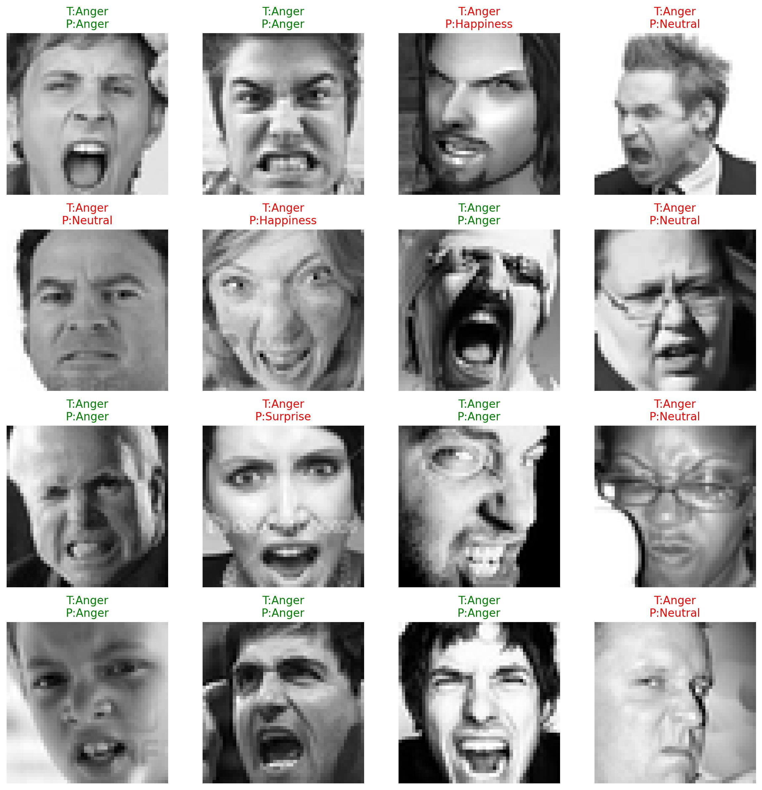
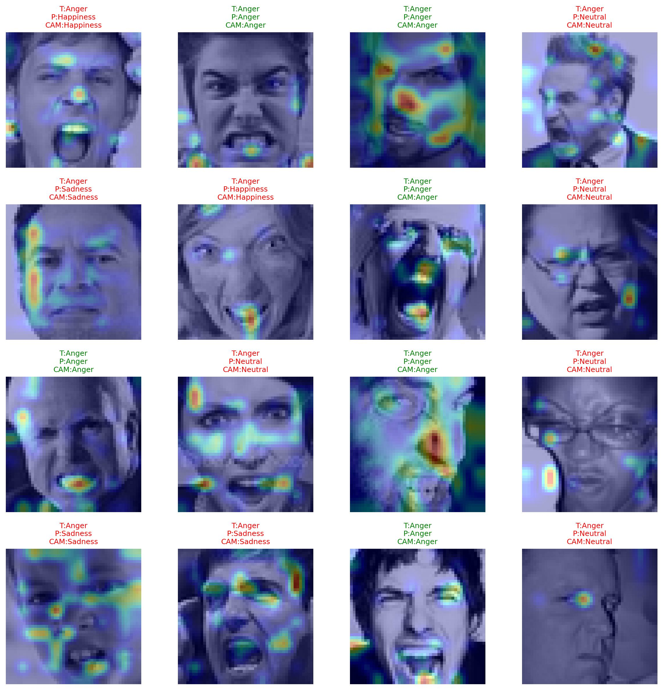

# Ham Piksel Verisinden Yüz İfadesi Tanıma için Derin Öğrenme Tabanlı CNN Modeli (FER2013 – 8 Sınıf)
*(A Deep Learning–Based CNN Model for Facial Expression Recognition from Raw Pixel Data)*


---

**GitHub Repository Name:** `fer2013-raw-pixel-cnn-8class`  
**Course:** Derin Öğrenme ve Uygulamaları  
**Student:** <YASİR ÖMER ALPARSLAN ((KERKÜKLÜ - KARKOUKLI))> (<STUDENT ID 244225708 >)   
**Instructor:** Öğr. Üyesi Dr. Selim Yılmaz  
**Date:** December 2025 – January 2026  

---

## Abstract / Özet

**EN:**  
This study presents a lightweight convolutional neural network (CNN) for facial expression recognition (FER) using the FER2013 dataset, relying solely on raw pixel data (48×48 grayscale).  
Unlike classical approaches based on hand-crafted features (HOG, LBP, SIFT), the proposed model learns discriminative representations end-to-end directly from pixels.  
Experimental results show that a compact CNN can achieve competitive performance on low-resolution facial emotion classification.

**TR:**  
Bu çalışmada, FER2013 veri seti kullanılarak yalnızca ham piksel verisine (48×48 gri seviye) dayanan hafif bir evrişimsel sinir ağı (CNN) sunulmaktadır.  
Elle çıkarılmış özniteliklere (HOG, LBP, SIFT) dayanan klasik yaklaşımların aksine, önerilen model uçtan uca (end-to-end) biçimde doğrudan piksellerden öğrenir.  
Deneysel sonuçlar, küçük ve hafif bir CNN mimarisinin düşük çözünürlüklü yüz ifadeleri için rekabetçi performans sağlayabildiğini göstermektedir.

---

## 1. Problem Definition / Problem Tanımı

**TR:**  
Bu proje, FER2013 veri setindeki yüz görüntülerinden ham piksel verisi (48×48 gri seviye) kullanarak duygu sınıflandırması yapmayı hedefler.  
Model, elle öznitelik çıkarımı (HOG / LBP / SIFT) veya klasik makine öğrenmesi yöntemleri olmadan, uçtan uca bir CNN mimarisi ile eğitilmiştir.

**EN:**  
This project performs facial expression recognition on the FER2013 dataset using raw pixel data only (48×48 grayscale).  
No hand-crafted feature extraction or classical machine learning methods are employed; the CNN learns representations end-to-end.

**Classes (8):**  
Anger, Contempt, Disgust, Fear, Happiness, Neutral, Sadness, Surprise

---

## 2. Dataset & Preprocessing / Veri Seti ve Ön İşleme

**EN:**  
- Dataset: FER2013 (48×48 grayscale facial images)  
- Normalization: pixel values scaled to [0, 1]  
- Data Augmentation (optional): small rotations, horizontal flipping, brightness/contrast jitter  
- Class imbalance handling (optional): class_weight, balanced sampling  

**TR:**  
- **Veri Seti:** FER2013 (48×48 gri seviye yüz görüntüleri)  
- **Normalizasyon:** piksel değerleri [0, 1] aralığına ölçeklenir  
- **Veri Artırma (opsiyonel):** küçük döndürme, yatay çevirme, parlaklık/kontrast değişimleri  
- **Sınıf dengesizliği:** class_weight veya dengeli örnekleme  

⚠️ *Not:* Bu repo, “ham piksel + derin öğrenme” şartına uygun olarak tasarlanmıştır.

---

## 3. Model Architecture & Rationale / Model Mimarisi ve Gerekçesi

**Architecture:**  
- Input: 48 × 48 × 1  
- Conv Blocks: Conv2D → BatchNorm → ReLU → MaxPooling  
- Regularization: Dropout  
- Classifier: Fully Connected + Softmax  
- Loss: Categorical Cross-Entropy  
- Optimizer: Adam  

**Motivation / Gerekçe:**  
Low-resolution facial images require lightweight yet expressive architectures to avoid overfitting while maintaining generalization ability.  
Düşük çözünürlüklü yüz görüntüleri için aşırı öğrenmeyi önleyen, ancak genelleme yeteneğini koruyan hafif CNN mimarileri tercih edilmiştir.

---

## 4. Installation / Kurulum

```bash
pip install -r requirements.txt
```

- Python 3.10+ recommended  
- TensorFlow / Keras backend  

---

## 5. How to Run / Çalıştırma

Option 1 – Same Directory Structure (Simple Setup)

English

You can place the entire FER2013 dataset inside a folder named fer2013, located in the same directory as the training code file.

The training code is contained in the Jupyter Notebook (or Python script) named:

Tam kodu eğitim.py 
Yüz İfadesi Tanıma CNN DL-last.ipynb
Recommended directory structure:


---

project_root/

```
project_root/
│
├── fer2013/
│   ├── train/
│   ├── validation/
│   └── test/
│
├── Yüz İfadesi Tanıma CNN DL-last.ipynb
└── Tam kodu eğitim.py
After verifying that the dataset folders are correctly placed, simply open the notebook and run all cells sequentially, or execute the Python script to start training.

Türkçe
Seçenek 1 – Aynı Dizin Yapısı (Basit Kurulum)

FER2013 veri setinin tamamını fer2013 adlı bir klasör altına yerleştirerek, eğitim kodu ile aynı dizinde bulundurabilirsiniz.

Eğitim kodu şu dosyalardan birinde yer almaktadır:

nginx
Tam kodu eğitim.py
veya

Yüz İfadesi Tanıma CNN DL-last.ipynb
Önerilen klasör yapısı:

---

proje_dizini/

```
proje_dizini/
│
├── fer2013/
│   ├── train/
│   ├── validation/
│   └── test/
│
├── Yüz İfadesi Tanıma CNN DL-last.ipynb
└── Tam kodu eğitim.py
Klasör yapısının doğru olduğundan emin olduktan sonra, notebook içindeki tüm hücreleri sırasıyla çalıştırmanız veya Python dosyasını çalıştırmanız yeterlidir.

Option 2 – Custom Dataset Path


### Training / Eğitim
```bash
python src/train.py --config configs/config.yaml
```

### Evaluation / Değerlendirme
```bash
python src/eval.py --weights models/best_emotion_cnn_8class.keras
```

### Inference (Single Image) / Tek Görüntü
```bash
python src/infer.py --image path/to/image.png --weights models/best_emotion_cnn_8class.keras
```

*Note:* Even if development was done in notebooks, script-based entry points are provided for reproducibility and grading.

---

## 6. Repository Structure

```
fer2013-raw-pixel-cnn-8class/
├─ src/
│  ├─ train.py
│  ├─ eval.py
│  ├─ infer.py
│  └─ utils.py
   ├─Tam kodu eğitim.py
   └─Yüz İfadesi Tanıma CNN DL-last.ipynb
├─ configs/
│  └─ config.yaml
├─ models/
│  └─ epoch_x/
│     ├─ best_emotion_cnn_8class.keras
│     └─ final_emotion_cnn_8class.keras
├─ outputs/
│  ├─ figures/
│  │  └─ epoch_x/
│  │    ├─accuracy_curve_8class.jpg
│  │    ├─ loss_curve_8class.jpg
│  │    ├─ confusion_matrix_counts_8class.jpg
│  │    ├─ confusion_matrix_normalized_8class.jpg
│  │    ├─ sample_predictions_8class.jpg
│  │    └─ gradcam_samples_8class.jpg
│  └─ metrics/
│     └─ epoch_x/
│        └─ classification_report_8class.txt
├─ presentation/
│  └─ final_presentation.pdf
├─ requirements.txt
└─ README.md
```

---

## 7. Experimental Results / Deneysel Sonuçlar

**Quantitative Metrics:**  
- Test Accuracy: **0.7181**  
- Test Loss: **0.9193**  
- Weighted F1-Score: **0.6908**  
- Macro F1-Score: **0.4184**

Lower performance is observed for *Contempt*, *Disgust*, and *Fear* due to class imbalance and limited samples.

### Training Curves
  

  

  

### Confusion Matrices
  


  


  

### Sample Predictions


### Grad-CAM Visualizations


Model attention focuses mainly on eyes, mouth, and facial muscles, confirming meaningful spatial reasoning.

---

## 8. Presentation / Sunum

📄 `presentation/Emotion_CNN_8Class_Presentation.pdf`  

All experiments and figures in the presentation exactly match the repository content.

---

## Acknowledgements / Teşekkür

- FER2013 Dataset (public / Kaggle mirror):  
  https://www.kaggle.com/code/pedroadorighello/gradcam-fer2013-test/input?select=fer2013plus  
- TensorFlow / Keras  

---

## Keywords
Facial Expression Recognition · CNN · Deep Learning · FER2013 · Raw Pixels · Grad-CAM
